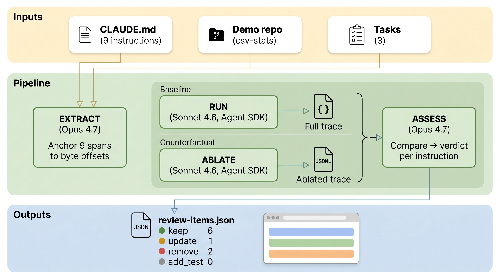

# Context Profiler

[](https://github.com/woop/context-profiler/actions/workflows/test.yml)
[](https://github.com/woop/context-profiler/actions/workflows/deploy.yml)

**[Design rationale](RATIONALE.md)** · **[Design decisions](docs/decisions.md)** · **[Coordination log](docs/worklog.md)**

A prototype that profiles CLAUDE.md instructions against real Claude Code session traces. For each instruction, it determines whether the agent followed it, ignored it, or contradicted it, and whether removing the instruction changes behavior. The prototype runs against a synthetic demo repo with known ground truth; the methodology is designed to generalize to any context injected into an agent.

**[Live demo](https://context-profiler.pages.dev)**

## How the pipeline works



**[Extract](profiler/extract.py)**: Parses the context file and returns each instruction as a verbatim snippet, anchored to exact byte offsets in the source.

**[Run](profiler/run_task.py)**: Runs each task in an isolated copy of the repo. All agent events are serialized to JSONL traces.

**[Ablate](profiler/run_task.py#L61)**: Re-runs the same task with a specific instruction removed. The resulting trace is compared against the full-context trace.

**[Assess](profiler/assess.py)**: Reads all traces (full and ablated) and produces a structured verdict per instruction: keep, update, remove, or add_test, with evidence and explanation.

**[Review](app/frontend/)**: Renders the context file with each instruction span highlighted by verdict. Clicking a span shows evidence and recommended actions.

The prototype runs 4 tasks against a 9-instruction CLAUDE.md, each task twice with full context (control pair), and every instruction ablated once. See [RATIONALE.md](RATIONALE.md) for methodology, tradeoffs, and limitations.

## Run it yourself

Requires: Python 3.11+, [uv](https://docs.astral.sh/uv/), Node 18+.

```bash
# Replay from committed artifacts (no API key needed)
uv run profiler/cli.py --replay

# Start the review UI
cd app/frontend && npm install && npm run dev

# Full pipeline (requires ANTHROPIC_API_KEY in .env)
uv run profiler/cli.py

# Re-assess without re-running tasks
uv run profiler/cli.py --skip-runs
```

All pipeline stages cache their outputs. The committed artifacts allow full replay without an API key.

## Architecture

```
profiler/
  extract.py       Extract instructions from context file
  run_task.py       Run tasks in isolated workspaces
  assess.py         Assess instructions against traces
  cli.py            Chain all stages

demo-repo/          Target repository with CLAUDE.md
  .profiler/
    instructions/   Extracted instruction spans with byte offsets
    inputs/         Task definitions
    runs/           Session traces (full + ablated)
    attribution/    Assessor output (raw + normalized)
    review/         review-items.json (UI contract)

app/frontend/       Review UI for the annotated context file
```

## Tests

65 tests across two suites:

- **profiler/** (38 Python): extract helpers, artifact integrity (schema validation, offset round-trip, cross-artifact ID consistency, ablation, evidence alignment)
- **app/frontend/** (27 vitest): highlight rendering, popover behavior, drift detection, real artifact integration

## AI session traces

[`traces/`](traces/) contains the raw Claude Code session logs (JSONL) for the four substantive sessions that produced this prototype:

- **[main-thread-and-backend/](traces/main-thread-and-backend/)** — primary orchestration thread: problem framing, direction decisions, and backend pipeline build (3 subagent traces)
- **[deployment/](traces/deployment/)** — Cloudflare Pages + GitHub Actions setup
- **[frontend/](traces/frontend/)** — Review UI build behind the locked `review-items` contract
- **[readme-diagrams/](traces/readme-diagrams/)** — Pipeline diagram iteration
